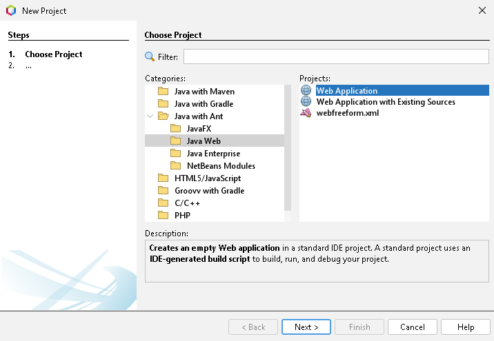
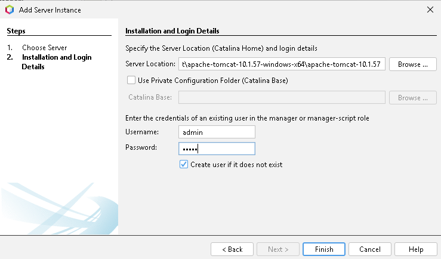
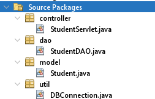
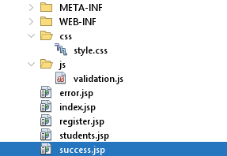
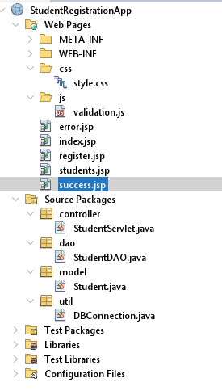

# JSP Web Apps - Servlet (Tomcat) & PostgreSQL Database - Class Guide

# 1. Introduction

This guide is intended to assist with what was covered in class on day 5 *(Monday, 13 July 2026)*. The structure of the guide will follow how class progressed. To get the best experience from this guide, I highly recommend you follow along as you read. In case you get stuck, I have included my code in the directory, so you can open the project in NetBeans, and hopefully fix any issues you may face. Also, please note that I am a student, and I can make mistakes. So if you spot anything I did incorrectly, please reach out to me *(student email provided below)* so I can fix my codebase. 

> Note: The enclosing directory contains the necessary files, packages, and directories needed to make the web application work. I am, however, unsure if everything works. So for this reason, any clarifications needed will be provided in class on the 14th of July when we complete the development of this project. 

If you have any questions, please reach out to me, Lebogang Masia, on 601562@student.belgiumcampus.ac.za.

**IMPORTANT: I expect the reader to be using BCDesktop, as this project was built completely on BCDesktop.**

# 2. Installation

## Using the browser and file explorer

Firstly, you will need to install Apache Tomcat:
 
1. Navigate to [the Apache downloads page](https://tomcat.apache.org/download-10.cgi).
2. Download the Windows 64-bit zip folder for the 10.1.57 version.
	-  Note: There were disruptions in class regarding the version of Tomcat to download. The code provided in this directory uses version 10.x.x, but I believe *(though not entirely sure)* that we are supposed to use version 9.x.x. However, I highly recommend using version 10.x.x to avoid any issues.
3. After the download concludes, navigate to the Downloads directory and unzip Tomcat.
4. Create a directory in the `C:\` drive called `tomcat`.
5. Move the extracted directory to the `C:\tomcat` directory.

## Using Windows PowerShell

Alternatively, you can use Windows PowerShell to complete the installation step if you prefer the command line: 

1. Open Windows PowerShell and ensure you are in the home directory. If, some reason, you are in the `system32` directory, change to the home directory:
```powershell
cd C:\Users\BC-STUDENT
```
2. Download Tomcat 10.1.57:
```powershell
Invoke-WebRequest -Uri "https://dlcdn.apache.org/tomcat/tomcat-10/v10.1.57/bin/apache-tomcat-10.1.57-windows-x64.zip" -OutFile "C:\Users\BC-STUDENT\Downloads\apache-tomcat-10.1.57-windows-x64.zip"
```
3. Change directories to `C:\Users\BC-STUDENT\Downloads`:
```powershell
cd C:\Users\BC-STUDENT\Downloads
```
4. Unzip Tomcat:
```powershell
Expand-Archive -Path ".\apache-tomcat-10.1.57-windows-x64.zip" -DestinationPath ".\apache-tomcat-10.1.57-windows-x64"
```
5. Create the `tomcat` directory in the `C:\` drive:
```powershell
mkdir C:\tomcat
```
6. Move the extracted directory into the new `tomcat` directory in the `C:\` drive:
```powershell
mv ".\apache-tomcat-10.1.57-windows-x64" C:\tomcat
```
# 3. NetBeans project setup

At this point, Apache Tomcat should be successfully downloaded and stored in the `C:\tomcat` directory. Let's now proceed with setting up our NetBeans environment. 

1. Open the NetBeans IDE.
2. If you have any projects open, be sure to close them, as keeping them open can cause confusion and lead to incorrect file-management.
3. Create a New Project.
4. Under the **"Categories"** section, click on the **"Java with Ant"** dropdown, and select **"Java Web"**, then select **"Web Application"** on the right panel

5. Click **"Next"** and name the project. Again, since this documentation file follows class structure, I recommend naming this project `StudentRegistrationApp`.
6. On the **"Server and Settings"** section, ensure that Apache Tomcat or TomEE is selected as the server.
7. Finally, on the **"Frameworks"** section, ensure that nothing is selected. 
8. Click **"Finish"** to create the project, and NetBeans will open up an `index.html` file. You can safely delete this file, as we will not be needing it *(we will replace it with `index.jsp`)*
9. After the project has been created, look for the **"Services"** tab on right panel.
	- If you can't find this panel, click on the "**Window**" option in the tool, and click on "**Services**".
10.  Right click on **"Servers"** and add  **"Apache Tomcat or TomEE"**.
11. Configure it as followed:
	- Under **"Server Location"**, add the path where we stored Tomcat. In my instance, it will be: `C:\tomcat\apache-tomcat-10.1.57-windows-x64\apache-tomcat-10.1.57`.
	- Username: `admin`
	- Password: `admin`



Quick note, if you get the following error: 

`The specified Server Location (Catalina Home) folder is not valid.`

then you have selected the wrong directory for the server location. Ensure that your selected path ends with `apache-tomcat-10.1.57` and not `apache-tomcat-10.1.57-windows-x64`. 
# 4. Project directory structure.

This project will follow an MVC approach, as we are dealing with a database and a user interface.

> Note: Refer to the slides for further clarifications, as the goal of this guide to catch you up on what was covered, not teach you the content.

You will need to create the following packages:
1. `controller` - Contains servlet infrastructure.
2. `dao` - Basically the data layer.
3. `model` - Contains user-defined data structures.
4. `util` - Contains utility functions.



Let's dive deeper into each package.

## Packages

### model

The `model` package currently only contains the `Student.java` file, which defines a type (`Student`):

`Student.java`
```java
package model;

public class Student {
    private int StudentID;
    private String firstName;
    private String lastName;
    private String email;
    private String phone;
    private String course;

    public Student () {}

    public Student(String firstName, String lastName, String email, String phone, String course) {
        this.firstName = firstName;
        this.lastName = lastName;
        this.email = email;
        this.phone = phone;
        this.course = course;
    }
    
    public Student(int StudentID, String firstName, String lastName, String email, String phone, String course) {
        this.StudentID = StudentID;
        this.firstName = firstName;
        this.lastName = lastName;
        this.email = email;
        this.phone = phone;
        this.course = course;
    }

    public int getStudentID() {
        return StudentID;
    }

    public void setStudentID(int StudentID) {
        this.StudentID = StudentID;
    }

    public String getFirstName() {
        return firstName;
    }

    public void setFirstName(String firstName) {
        this.firstName = firstName;
    }

    public String getLastName() {
        return lastName;
    }

    public void setLastName(String lastName) {
        this.lastName = lastName;
    }

    public String getEmail() {
        return email;
    }

    public void setEmail(String email) {
        this.email = email;
    }

    public String getPhone() {
        return phone;
    }

    public void setPhone(String phone) {
        this.phone = phone;
    }

    public String getCourse() {
        return course;
    }

    public void setCourse(String course) {
        this.course = course;
    }   
}

```

### util

The `util` package has a `DBConnection` class which allows us to connect to a local PostgreSQL server:

`DBConnection.java`
```java
package util;

import java.sql.*;

public class DBConnection {
    private static final String URL = 
            "jdbc:postgresql://localhost:5432/studentdb";
    private static final String USER = "admin";
    private static final String PASS = "admin";
    
    public static Connection getConnection() {
        Connection conn = null;
        try {
            Class.forName("org.postgresql.Driver");
            conn = DriverManager.getConnection(URL, USER, PASS);
            System.out.println("Connected");
        } catch (ClassNotFoundException | SQLException ex) {
            System.out.println(ex.getMessage());
        }
        return conn;
    }
}
```

### dao

The `dao` or `Data Access Object` package contains all the relevant code needed to send and retrieve data from the database. 

`StudentDAO.java`
```java
package dao;

import model.Student;
import util.DBConnection;
import java.sql.Connection;
import java.sql.PreparedStatement;
import java.sql.SQLException;

public class StudentDAO {
    public boolean saveStudent(Student st) {
        boolean status = false;
        String sql = 
                "INSERT INTO Students(fname, lname, email, phone, course)"
                + "VALUES(?, ?, ?, ?, ?)";
        
        try {
            Connection conn = DBConnection.getConnection();
            PreparedStatement ps = conn.prepareStatement(sql);
            ps.setString(1, st.getFirstName());
            ps.setString(1, st.getLastName());
            ps.setString(1, st.getEmail());
            ps.setString(1, st.getPhone());
            ps.setString(1, st.getCourse());
            
            int rows = ps.executeUpdate();
            
            if (rows > 0) {
                status = true;
            }
            ps.close();
            conn.close();
        } catch (SQLException ex) {
            System.out.println(ex.getMessage());
        }
        return status;
    }
}
```

### controller

The controller package contains the servlet infrastructure, which essentially updates the database based on user-interaction:

> Note, the code I have for this package might be incorrect, as it was the last thing we covered in class, and I had a lot of errors I had to fix. If it is incorrect, please reach out to me *(student email provided in Introduction section)* so I can fix it :).

`StudentServlet.java`
```java
package controller;

import model.Student;
import dao.StudentDAO;

import java.io.IOException;
import java.io.PrintWriter;
import jakarta.servlet.ServletException;
import jakarta.servlet.http.HttpServlet;
import jakarta.servlet.http.HttpServletRequest;
import jakarta.servlet.http.HttpServletResponse;
import jakarta.servlet.*;

public class StudentServlet extends HttpServlet {

    protected void doPost(HttpServletRequest request, HttpServletResponse response)
            throws ServletException, IOException {
                String firstName = request.getParameter("firstname");
                String lastName = request.getParameter("lastname");
                String email = request.getParameter("email");
                String phone = request.getParameter("phone");
                String course = request.getParameter("course");

                Student student = new Student(firstName, lastName, email, phone, course);
                StudentDAO dao = new StudentDAO();
                boolean result = dao.saveStudent(student);

                if (result) {
                    response.sendRedirect("success.jsp");
                } else {
                    response.sendRedirect("error.jsp");
                }
        }
    }
```

## JSP, CSS, and JavaScript files.

We created 5 .jsp files under the `Web-Pages` directory, namely:
1. `error.jsp`
2. `index.jsp`
3. `register.jsp`
4. `students.jsp`
5. `success.jsp`

These files currently contain the default HTML, and we will work on them on the 14th of July. 

Furthermore, on BC Connect, you will find a zip folder *(under the **"Extra Files for Class"** section)* containing a `styles.css` file, and a `validation.js` file. These files should be stored in a `css` folder, and a `javascript` folder, respectively *(see the screenshot below)*. You can click [here](https://connect.belgiumcampus.ac.za/mod/resource/view.php?id=19373) to download the zip folder. These files contain pre-written CSS and JavaScript files that we will use in class. Ensure you store them in the correct directories.




After all of this, this should be your final project structure:



# 5. Conclusion

This guide walks you through the class content covered on the 13th of July 2026. We first explore the installation of Apache Tomcat, which is a servlet container designed specifically to execute Java code, render dynamic web pages, and host Java-based web-applications. Then, we set up create and configure NetBeans to ensure that we have a smooth experience building our Student Registration Web Application. The project, although unfinished, follows an MVC approach: we use the model package to store data, the dao and controller packages to connect to the database and manipulate data *(also part of the **model**, come to think of it)*, and the controller package to link user-interaction and database queries. This project is expected to be completed on the 14th of July 2026. If this guide helped you, please consider sharing it with other students as they may also benefit from it :).
